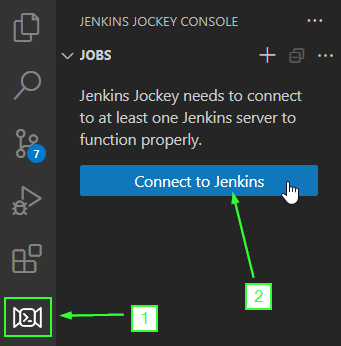
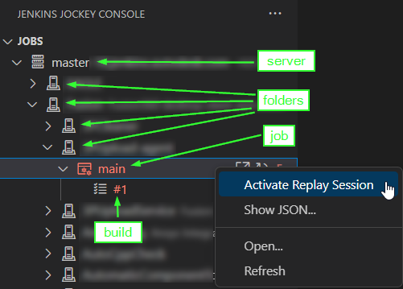
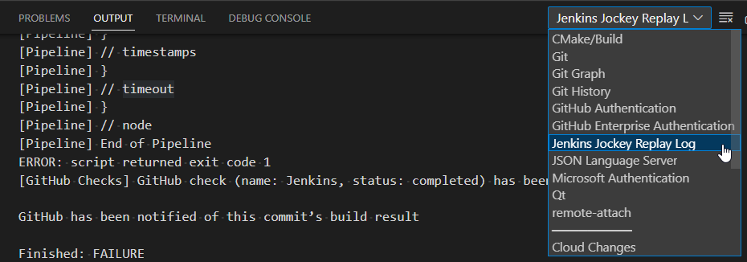
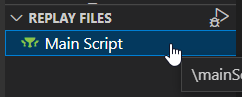
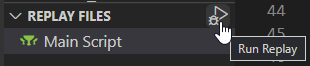
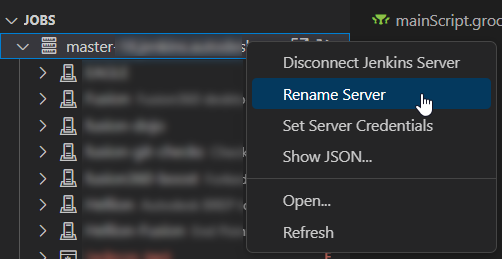

# Jenkins Jockey

An extension for Visual Studio Code that aids in debugging pipeline scripts and shared libraries. This
extension is generally designed around the [replay
capability](https://www.jenkins.io/blog/2016/04/14/replay-with-pipeline/) in Jenkins.

## Features

- Connect to any number of Jenkins servers.
- Browse jobs and builds in a tree view.
  - Refresh jobs to see current status.
  - Easily open jobs and builds in a web browser.
  - View logs for builds in a new document tab.
  - Filter out disabled jobs.
- Debug pipeline scripts and shared libraries (aka Replay).
  - Launch Replay from any build or job.
  - See all pipeline script and shared library files used in the previous build.
  - Edit files from the previous build, to be submitted when a new replay is triggered.
  - See build log in VS Code output window.
    - Files mentioned in errors in the log are linked directly to the files shown in the file list.
    - Output window shows incremental build log output, just like the Jenkins web views.
  - Errors found in the build log are highlighted in the source code.
  - Compare pipeline script and shared library files with the original files from the previous build.
  - Compare pipeline script and shared library files with files found in the current workspace.
  - Trigger a build with local changes made to files.
    - Automatically tracks the new build, showing log output and files.

## Getting Started

The following is a typical workflow using Jenkins Jockey to debug pipeline scripts and shared libraries:

1. Add a Jenkins server:

   
2. Find a job and activate replay:

   
3. Find errors in files:

   
4. Make edits to the files (remember to save):

   
5. Run the replay with your new changes:

   
6. Repeat steps 4-6 as needed.

Some additional things to do:

- Rename your server:
  
  

Always check contextual menus, there's usually more!

## Troubleshooting

It is quite possible that Jeknins Jockey will display a job with `(unknown)` as a suffix if you have some
plugins installed on your Jenkins server that create unknown types of jobs or job containers. In this event,
you can correct this problem by right-clicking on the item in the tree with `(unknown)` in the name and choose
whether it is a job or job container (folder).

## Extension Settings

This extension contributes the following settings:

- `jenkinsJockey.servers`: The list of servers (array of objects), where each server specifies a `url`
  property (the root of the server), and a `label` for the server

  ```json
  "jenkinsJockey.servers": [
    {
      "url": "https;//jenkins.example.com",
      "label": "my server label"
    }
  ]
  ```

- `jenkinsJockey.extraJobClasses`: a list of Jenkins classes to consider jobs. This can be used to resolve job
  items in the browser with `(unknown)` that are not usable.
- `jenkinsJockey.extraJobContainerClasses`: a list of Jenkins classes to consider job containers. This can be
  used to resolve items in the browser with `(unknown)` that are not usable.
- `jenkinsJockey.hideDisabled`: if checked, hides disabled jobs from the job browser.

## Release Notes

### 0.0.1

Initial release

## Future Development

- Add a command to trigger a build from the job tree (no parameters).
- Add a command to trigger a build with parameters from the job tree.
- Add a command to save groovy file changes in the replay to the open workspace.

## Developer Information

An API is available to access the functionality and data of this extension. Please see the
[wiki](https://github.com/douppc/jenkins-jockey/wiki) on the GitHub project page for details.

## Feedback

Please report any issues or requests on the [GitHub
Project](https://https://github.com/douppc/jenkins-jockey).

## License

Jenkins Jockey is released under the [MIT License](LICENSE).
